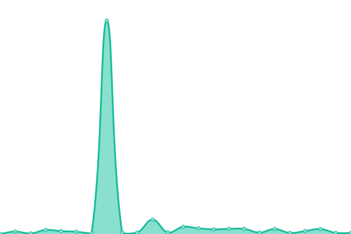

# [📈 Live Status](https://status.utcwiki.com): <!--live status--> **一切正常**

This repository contains the open-source uptime monitor and status page for [僵尸君呀](https://status.utcwiki.com), powered by [Upptime](https://github.com/upptime/upptime).

With [Upptime](https://upptime.js.org), you can get your own unlimited and free uptime monitor and status page, powered entirely by a GitHub repository. We use [Issues](https://github.com/gzombiejun/upptime/issues) as incident reports, [Actions](https://github.com/gzombiejun/upptime/actions) as uptime monitors, and [Pages](https://status.utcwiki.com) for the status page.

<!--start: status pages-->
<!-- This summary is generated by Upptime (https://github.com/upptime/upptime) -->
<!-- Do not edit this manually, your changes will be overwritten -->
<!-- prettier-ignore -->
| URL | Status | History | Response Time | Uptime |
| --- | ------ | ------- | ------------- | ------ |
|  [Undertale社区维基 - UTCWIKI](https://utcwiki.com) | 正常 | [undertale-utcwiki.yml](https://github.com/gzombiejun/upptime/commits/HEAD/history/undertale-utcwiki.yml) | 

 4421毫秒
     
 | 

<a href="https://status.utcwiki.com/history/undertale-utcwiki">99.49%</a>
    

|  [Undertale社区维基 测试站 - UTCWIKIT](https://test.utcwiki.com) | 正常 | [undertale-utcwikit.yml](https://github.com/gzombiejun/upptime/commits/HEAD/history/undertale-utcwikit.yml) | 

 3904毫秒
     
 | 

<a href="https://status.utcwiki.com/history/undertale-utcwikit">98.99%</a>
    

|  [Undertale自由维基 - UTFWIKI](https://free.utcwiki.com) | 正常 | [undertale-utfwiki.yml](https://github.com/gzombiejun/upptime/commits/HEAD/history/undertale-utfwiki.yml) | 

 1572毫秒
     
 | 

<a href="https://status.utcwiki.com/history/undertale-utfwiki">99.49%</a>
    

|  [Undertale社区档案馆 - UTCARC](https://arc.utcwiki.com) | 正常 | [undertale-utcarc.yml](https://github.com/gzombiejun/upptime/commits/HEAD/history/undertale-utcarc.yml) | 

 933毫秒
     
 | 

<a href="https://status.utcwiki.com/history/undertale-utcarc">100.00%</a>
    

|  [Undertale社区项目路线图 - UTCPRP](https://road.utcwiki.com) | 正常 | [undertale-utcprp.yml](https://github.com/gzombiejun/upptime/commits/HEAD/history/undertale-utcprp.yml) | 

 942毫秒
     
 | 

<a href="https://status.utcwiki.com/history/undertale-utcprp">100.00%</a>
    

<!--end: status pages-->

[**Visit our status website →**](https://status.utcwiki.com)

## 📄 License

- Powered by: [Upptime](https://github.com/upptime/upptime)
- Code: [MIT](./LICENSE) © [Anand Chowdhary](https://anandchowdhary.com), supported by [Pabio](https://pabio.com)
- Data in the `./history` directory: [Open Database License](https://opendatacommons.org/licenses/odbl/1-0/)
